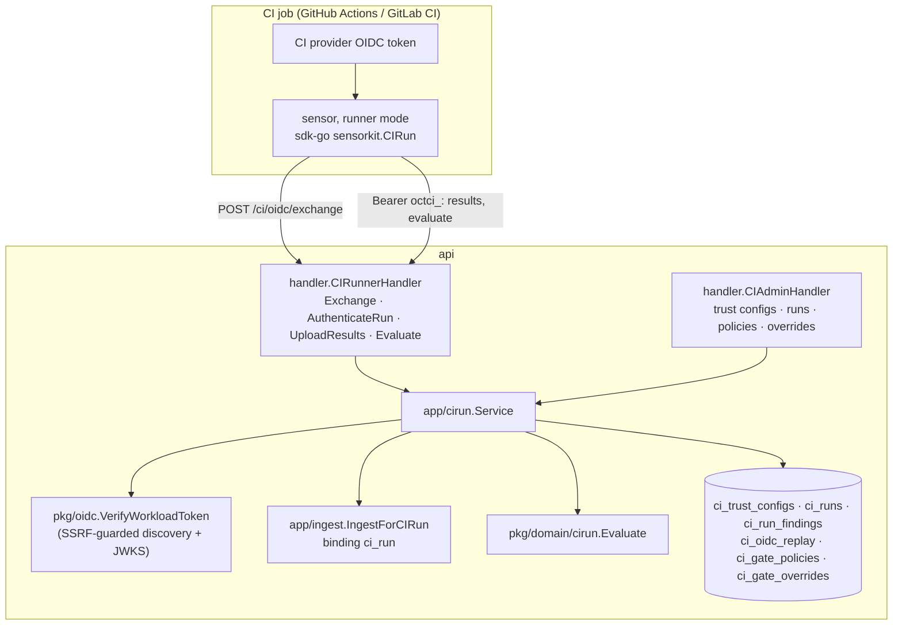

# CI runner identity and the CI gate

> Design: [RFC-051](../rfcs/RFC-051-ci-runner-identity-and-gate.md). How to
> connect a pipeline: [how-to/connect-ci-pipelines.md](../how-to/connect-ci-pipelines.md).
> The scanning path in CI itself: [shift-left-ci-scanning.md](shift-left-ci-scanning.md).

## Components

| Piece | Where |
|---|---|
| Domain: trust rules, claims parsing, run, gate evaluation | `pkg/domain/cirun` |
| Workload token verification | `pkg/oidc/workload.go` |
| Service: exchange, continuation, upload scoping, policy resolution, evaluate, administration | `internal/app/cirun` |
| Ingest entry point and the `ci_run` binding | `internal/app/ingest/ci_run.go`, `binding.go` |
| Repository | `internal/infra/postgres/ci_run_repository.go` |
| Routes and their chains | `internal/infra/http/routes/ci.go` |
| Console | `web/src/features/ci-runners` (`/ci-runners`, `/settings/scanning/ci`) |
| Migration | `001058_ci_runner_identity` |

## Request chains

| Route | Chain |
|---|---|
| `POST /api/v1/ci/oidc/exchange` | per-IP token-exchange limit (60/min, shared store) → handler (32 KB body, unknown fields refused) |
| `POST /api/v1/ci/runs/{id}/results` | per-IP limit → `AuthenticateRun` (token hash lookup, path id = run) → per-run limit → ingest per-tenant limit and concurrency cap → 50 MB body → decompression |
| `POST /api/v1/ci/runs/{id}/baseline-diff`, `/evaluate` | per-IP limit → `AuthenticateRun` → per-run limit |
| `/api/v1/ci/{trust-configs,runs,gate-policies,gate-overrides}` | session tenant chain → `scans` module → `scans:ci:*` |

## Data model

- `ci_trust_configs`: per tenant; `rules` JSONB (owners, repositories, refs,
  environments, events, fork and protected-ref switches).
- `ci_runs`: per tenant, composite FK to the tenant's repository asset
  (cascade). Token hash (unique) and expiry; verdict and its JSON detail.
- `ci_run_findings`: `(run_id, fingerprint)`; the gate joins it to `findings`
  of the run's asset.
- `ci_oidc_replay`: `(issuer, jti)`, global.
- `ci_gate_policies`: one per `(tenant, scope_type, scope_id)`.
- `ci_gate_overrides`: per tenant, composite FK to the repository asset.

## Invariants

- A run never creates a sensor row and has no heartbeat; fleet views and
  offline alerts never see it.
- The run's branch, commit, pull request and pipeline URL come from the
  verified token; the report's own branch information is replaced.
- A run's report changes only its repository asset; the baseline branch is
  decided server-side.
- Neither the CI provider's token nor the run token is logged, stored (only the
  run token's SHA-256) or audited.
- Refusals are uniform to the caller and detailed in the audit log only after
  the token verified.
