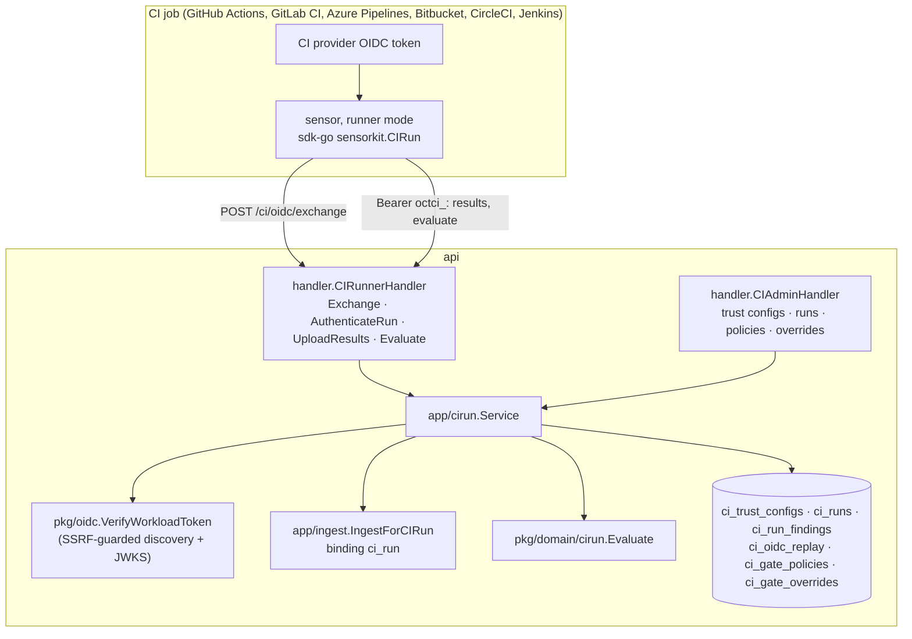

# CI runner identity and the CI gate

> Design: [RFC-051](../rfcs/RFC-051-ci-runner-identity-and-gate.md). How to
> connect a pipeline: [how-to/connect-ci-pipelines.md](../how-to/connect-ci-pipelines.md).
> The scanning path in CI itself: [shift-left-ci-scanning.md](shift-left-ci-scanning.md).

## Components



| Piece | Where |
|---|---|
| Domain: trust rules, claims parsing, run, gate evaluation | `pkg/domain/cirun` |
| Per-provider issuers, audiences and claim mapping (RFC-051 section 3.1) | `pkg/domain/cirun/providers.go` |
| Trust preview (sample token against a draft) | `internal/app/cirun/preview.go` |
| Workload token verification | `pkg/oidc/workload.go` |
| Service: exchange, continuation, upload scoping, policy resolution, evaluate, administration | `internal/app/cirun` |
| Ingest entry point and the `ci_run` binding | `internal/app/ingest/ci_run.go`, `binding.go` |
| Repository | `internal/infra/postgres/ci_run_repository.go` |
| Routes and their chains | `internal/infra/http/routes/ci.go` |
| Console | `web/src/features/ci-runners`: CI/CD integration page `/ci-cd` (pipelines, runs, coverage; Trust and gate tab), also `/settings/scanning/ci`; `/ci-runners` and `/runners` redirect to `/ci-cd` |
| Pipelines: identity, status, fleet rows | `pkg/domain/cirun/pipeline.go`, `internal/app/cirun/pipelines.go`, `internal/infra/postgres/ci_pipeline_repository.go`, `handler/ci_pipeline_handler.go` |
| Fleet read model (`GET /api/v1/fleet`) | `handler/fleet_handler.go`, `handler/sensor_fleet.go`, `routes/fleet.go` |
| Coverage, expectations, retirement | `pkg/domain/cirun/coverage.go`, `internal/app/cirun/coverage.go`, `internal/infra/postgres/ci_coverage_repository.go`, `handler/ci_coverage_handler.go` |
| Alerts and stale sources (every 15 minutes, one replica) | `internal/app/cirun/alerts.go`, `internal/infra/controller/ci_alerts.go` |
| Migration | `001077_ci_runner_identity`, `001084_ci_pipelines`, `001099_ci_coverage_alerts`, `001144_ci_db_model`, `001145_ci_db_model_validate` |
| Retention (hourly, one replica) | `internal/app/cirun/retention.go`, `internal/infra/postgres/ci_retention_repository.go`, `internal/infra/controller/ci_retention.go` |
| Break-glass notices to administrators (in-app and `ci.break_glass`) | `internal/app/cirun/admin_alerts.go` |
| Migration | `001077_ci_runner_identity`, `001084_ci_pipelines`, `001099_ci_coverage_alerts` |

## Request chains

| Route | Chain |
|---|---|
| `POST /api/v1/ci/oidc/exchange` | per-IP token-exchange limit (60/min, shared store) → handler (32 KB body, unknown fields refused) |
| `POST /api/v1/ci/trust-configs/preview` | session tenant chain → `scans` module → `scans:ci:write` → per-person limit (10/min) |
| `POST /api/v1/ci/runs/{id}/results` | per-IP limit → `AuthenticateRun` (token hash lookup, path id = run) → per-run limit → ingest per-tenant limit and concurrency cap → 50 MB body → decompression |
| `POST /api/v1/ci/runs/{id}/baseline-diff`, `/evaluate` | per-IP limit → `AuthenticateRun` → per-run limit |

Budgets beyond the chains: at most 200 reports per run (`cirun.MaxRunReports`,
`409`), at most 300 runs per pipeline per hour (`cirun.MaxPipelineRunsPerHour`,
refused at the exchange and audited `pipeline_rate`), 100,000 recorded
findings per run.
| `/api/v1/ci/{trust-configs,runs,pipelines,gate-policies,gate-overrides}` | session tenant chain → `scans` module → `scans:ci:*` |
| `GET /api/v1/fleet` | session tenant chain → `sensors:read` or `scans:ci:read`; the handler lists each mode under its own permission (runner rows also need the `scans` module) |

## Data model

- `ci_trust_configs`: per tenant; `rules` JSONB (owners, repositories, refs,
  environments, events, fork and protected-ref switches).
- `ci_runs`: per tenant, composite FK to the tenant's repository asset
  (cascade) and to its trust configuration (`(tenant_id, trust_config_id)`,
  `SET NULL (trust_config_id)`: deleting a configuration keeps its runs as
  history). Token hash (unique) and expiry; verdict and its JSON detail; the
  provider's run id, attempt and job id (`external_job_id`, migration
  `001137`) from the verified claims.
- `ci_run_findings`: `(run_id, fingerprint)`; the gate joins it to `findings`
  of the run's asset.
- `ci_oidc_replay`: `(issuer, jti)`, global. A provider that sends no `jti`
  (Bitbucket, CircleCI, Jenkins) is recorded under `sha256:<token hash>`.
- `ci_runs.commit_verified` (migration `001240`): false when the provider
  signs no commit and the run's commit is the job's report; such a commit
  never matches a break-glass.
- Providers: `github`, `gitlab`, `azure_devops`, `bitbucket`, `circleci`,
  `jenkins` (the `ci_trust_configs` and `ci_pipelines` CHECKs, migration
  `001240`).
- `ci_gate_policies`: one per scope. A repository policy names
  `repository_asset_id`, a business-unit policy `business_unit_id`, each a
  composite FK (cascade); the repository's policy follows it on asset merge
  (the kept repository's own wins). The API keeps `scope_type` + `scope_id`.
- `ci_gate_overrides`: per tenant, composite FK to the repository asset. The
  creator is `created_by` (a user id); its email is read from `users` when the
  override is read and is never stored, and the gate verdict (printed in CI
  logs) names no person.
- `ci_pipelines`: per tenant, unique `(tenant, provider, issuer,
  external_repo_id, workflow_path)`, composite FK to the repository asset
  (cascade; moved by asset merge). Holds the run summary the status is
  computed from (last run, fork run, default-branch and pull request
  verdicts, scanner failures, runner version, tools, median and schedule
  intervals, revocation, retirement). `ci_runs.pipeline_id` (composite FK)
  links each run.
- `ci_coverage_expectations`: one per `(tenant, repository asset)`, composite
  FK to the asset (cascade; moved by asset merge); the expected capabilities
  (empty = all four).
- `ci_alert_state`: one row per `(tenant, subject, kind)` while the alert's
  condition holds; the notification is sent when the row is created.
- `ci_pipelines.trust_config_id` carries the tenant like `ci_runs`
  (migrations `001144`, validated by `001145`).

### Retention

The CI retention job (`internal/app/cirun/retention.go`,
`controller/ci_retention.go`, hourly, one replica) walks the tenants with a
pipeline or a trust configuration and, per tenant, in bounded batches:

| Data | Kept | Rule |
|---|---|---|
| `ci_runs.token_hash` | until the token expired an hour ago | cleared; the run stays |
| `ci_run_findings` | 90 days | the fingerprints of older runs are deleted |
| `ci_runs` | 400 days | older runs are deleted (their fingerprints cascade) |

Each pipeline's latest run and its latest default-branch run are always kept,
whatever their age: the pipeline summary and the gate's baseline read them.
Retention only makes the stale-source logic more conservative (it never
touches a finding it cannot attribute to a run).

### Naming rule

- `ci_*` tables hold facts that exist because a CI workload proved its
  identity with its provider's OIDC token: trust, pipelines, runs, the run
  gate, CI coverage and alerts. No `ci_*` table is renamed.
- Facts that more than one producer can report get plain domain names and are
  reserved, not built: `deployments`, `artifacts`, `artifact_attestations`
  (and `environments` once an environment carries its own attributes). They
  will reference a CI run as one possible source.
- A definition is `<x>`, its executions `<x>_runs` (`ci_pipelines`,
  `ci_runs`). A CI run is not a scan run: it is never dispatched, has its own
  credential and its own verdict, and lives in `ci_runs`, not `pipeline_runs`.

### Exchange and pipeline flow

```mermaid
sequenceDiagram
  participant J as CI job
  participant S as cirun.Service
  participant DB as Postgres
  J->>S: OIDC token
  S->>S: verify, admit (trust rules)
  S->>S: PipelineKeyFromClaims (repository id + workflow path)
  S->>DB: claim jti
  S->>DB: UpsertPipeline (advisory lock per tenant, caps, legacy adoption)
  S->>DB: CreateRun (pipeline_id, runner version)
  S->>DB: RefreshPipeline (summary from runs; fork runs excluded)
  S-->>J: run + octci_ token
```

## Invariants

- A run never creates a sensor row and has no heartbeat; offline alerts never
  see it. Its pipeline is listed in the fleet in runner mode and is never
  offline and never dispatched.
- A pipeline is created only at a verified, admitted exchange, keyed by signed
  immutable ids; branch, job and tool labels never create rows.
- Every fleet source is tenant-scoped and the runner rows follow the data
  scope; the fleet handler adds no query of its own.
- The run's branch, commit, pull request and pipeline URL come from the
  verified token; the report's own branch information is replaced.
- A run's report changes only its repository asset; the baseline branch is
  decided server-side.
- A finding the run sees only on a non-counting branch is branch-only: left
  out of exposure views until a counting branch sees it
  (`branch-only-findings.md`).
- Neither the CI provider's token nor the run token is logged, stored (only the
  run token's SHA-256) or audited. The trust preview stores nothing and
  records no token id.
- A trust configuration is read only for the tenant the exchange names, by
  its exact issuer, and a token is read with that configuration's provider
  mapping only.
- Coverage lists only repositories in the caller's data scope; marking a
  repository or retiring a pipeline out of scope is a 404. The alert job lists
  tenants once and every later query is tenant-scoped.
- Stale marking and retirement touch only open findings on the pipeline's
  repository that this pipeline alone reported and nothing saw after its last
  run; findings from people (pentest, manual, bug bounty, red team) are never
  touched. A new sighting reopens a not-observed finding.
- A run token is renewed only for the job it was issued to (same run id,
  attempt and job id).
- Audited: exchange (`ci_run.token_issued`/`token_refused`), each upload
  (`ci_run.results_uploaded`), the verdict (`ci_run.evaluated`) and each
  break-glass create, revoke and use. The actor is `ci:<provider>:<login>`.
- With "OIDC required for CI" (`tenants.ci_require_oidc`, default on for new
  organizations), a one-shot sensor's key is refused on every sensor route
  (`cirun.RunnerKeyPolicy`, wired into both sensor authenticators); the
  setting is read only for one-shot sensors, and an unreadable setting
  refuses.
- A run token (`octci_`) authenticates only `/ci/runs/{its id}/{results,
  baseline-diff,evaluate}`: every session, API-key, console and MCP route
  refuses it, and the run routes refuse every other credential
  (`routes/ci_run_token_scope_db_test.go`). Another run's id answers 404.
- Refusals are uniform to the caller and detailed in the audit log only after
  the token verified.
