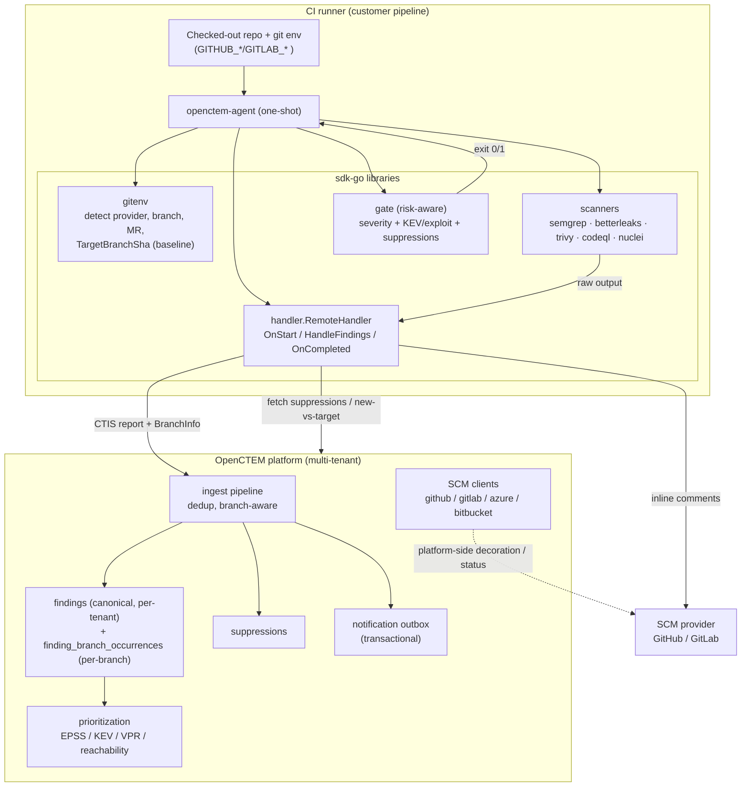
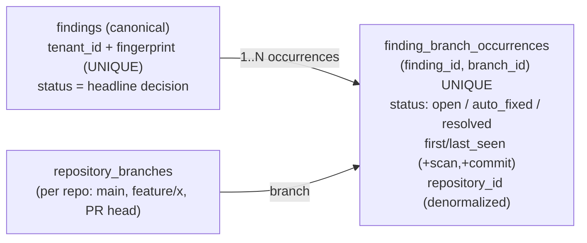

# Shift-Left CI/CD Code Scanning (agent-first)

> Self-contained SAST/SCA/secret scanning in the pipeline → CTIS ingest →
> branch-aware findings → **risk-aware gate** + **PR/MR decoration**. Design:
> [RFC-008](../rfcs/RFC-008-native-shift-left-ci-scanning.md). Complements
> [Scan Orchestration](scan-orchestration.md) (platform-run scanners) — this doc
> covers the **CI-runner** scanning path. How a CI job authenticates (OIDC,
> no stored key) and gets a central pass/fail verdict:
> [CI runner identity and the CI gate](ci-runner-identity.md) (RFC-051).

OpenCTEM runs its **own** agent in the customer's CI (no third-party tool, no
bridge). The agent detects the CI environment, runs scanners on the checked-out
code, pushes CTIS, then gates the build by **real risk** (EPSS/KEV/VPR), not just
severity — and comments findings inline on the PR/MR.

## 1. Component structure



## 2. End-to-end data flow (one PR scan)

```mermaid
sequenceDiagram
  participant CI as CI runner
  participant AG as openctem-agent
  participant SCAN as scanner (semgrep/…)
  participant API as OpenCTEM API
  participant SCM as GitHub/GitLab

  CI->>AG: run (auto-detect CI env)
  AG->>AG: gitenv → repo, commit, branch, MR, TargetBranchSha
  AG->>API: OnStart(scan) → ScanInfo{baseline LastCommitSha}
  AG->>SCAN: scan (ChangedFileOnly for PRs)
  SCAN-->>AG: raw findings
  AG->>AG: parse → CTIS report + BranchInfo
  AG->>API: HandleFindings (PushFindings: CTIS)
  API->>API: dedup by fingerprint; upsert finding_branch_occurrences (this branch)
  API->>API: auto-resolve ONLY on default branch + full coverage (canonical safe)
  API-->>AG: suppressions + new_fingerprints (baseline-diff)
  AG->>SCM: inline PR/MR comments (new findings on changed files)
  AG->>AG: gate: block if finding ≥ threshold OR KEV/exploit (minus suppressed)
  AG-->>CI: exit 0 (pass) / 1 (fail)
```

## 3. Finding storage: repo vs branch

A finding has **branch-independent identity** (`findings`, unique
`tenant_id + fingerprint`); per-branch presence lives in
`finding_branch_occurrences`. One finding on `main` **and** a feature branch =
**one** `findings` row + **two** occurrence rows — cross-branch correlation
preserved, per-branch lifecycle enabled.



**Invariants**
- Canonical `findings.status` changes **only** from a **default-branch, full-coverage** scan bound to a command that completed cleanly (feature/PR scans write occurrences only). Protects against a feature branch, a failed run or an unbound upload mass-resolving real findings.
- Default-branch flag is never silently re-pointed on ingest (anti-abuse).
- Auto-resolve is scoped (tool × scan × assets/branch) — a partial/PR scan never resolves findings outside its scope.

### Which findings auto-resolve (decision, 2026-10)

Auto-resolve closes a finding because a scan **did not report it**. That is
only evidence of a fix when the scan provably covered the same code, so the
scope is deliberately narrow:

| Finding sits on | Auto-resolves? | Why |
|---|---|---|
| A repository asset, on its **default branch** (`findings.branch_id` → `repository_branches.is_default`) | Yes — only by a protocol v2 run **bound to a command** that completed with exit 0 and nothing rejected, an explicitly full scan of that branch, same tool and same scan profile as the finding's last sighting (research 18 F3; see `sensors.md`). A CI upload without a command, a tenant upload or a v1 report never closes (owner decision O11). | A clean full scan of the default branch with the same ruleset sees the whole codebase; absence means the code is gone. A failed run, a narrower ruleset or an unbound report proves nothing. |
| A repository asset, on a feature branch | No (its occurrence on that branch is marked `auto_fixed` instead) | A feature branch is not the source of truth. |
| A domain, host, IP, service, cloud or any other non-repository asset | **No** | Absence from a network or external scan is not evidence of a fix: hosts go down, ports get filtered, rate limits and template sets vary between runs. These findings close through retest/validation, a human, or the scanner reporting them fixed. `resolveBranches` only tracks branches for repository assets, and the auto-resolve query joins to the default branch, so this holds for every ingest path. |

`findings.branch_id` is what puts a finding in the first row. It is set when a
finding is created from a report that carries branch info, and — since this
decision — **backfilled** when an existing finding is reported again
(`FindingRepository.BackfillFindingBranches`, ingest Step 6):

- a finding with **no branch** (first ingested without branch info, or before
  branch tracking worked; see migration 000174) takes the scanned branch;
- a finding on another branch **moves to the default branch** when the scan is
  of the repository's default branch, as recorded in `repository_branches`
  (never as claimed by the report — same anti-abuse rule as above);
- a feature-branch scan never moves a finding that already has a branch, and a
  branch is only ever attached to findings of its own repository.

Without the backfill a finding first seen without a branch, or first seen on a
PR branch (the common path for a newly introduced issue), could never be
auto-resolved however many default-branch scans later stopped reporting it.

Known gap: the Tenable `.nessus` findings import was designed to auto-resolve
host findings per batch (RFC-007) and emits a synthetic default branch for it,
but host findings have no branch, so it does not auto-resolve today. Enabling
absence-based resolution for that one server-side, batch-scoped path is a
product decision tracked separately; see `scan-coverage.md`.

## 4. Component responsibilities

| Component | Responsibility |
|---|---|
| `sdk-go/pkg/gitenv` | Detect CI provider + repo/commit/branch/MR/baseline; post MR comments |
| `sdk-go/pkg/handler` | Scan lifecycle (OnStart/HandleFindings/OnCompleted); push CTIS; orchestrate comments |
| `sdk-go/pkg/scanners` | Run + parse each scanner → CTIS |
| `agent/internal/gate` | **Risk-aware** CI gate: severity threshold + KEV/exploit override + suppressions → exit code |
| api ingest | Dedup, branch-aware occurrence write, scoped auto-resolve |
| api prioritization | EPSS/KEV/VPR enrichment (feeds risk-aware gate + views) |
| api SCM clients | Repo/branch read; (Phase 4) platform-side PR decoration |
| api outbox | Reliable notifications (digest, alerts) |

## 5. Phase status (see RFC-008)

| Phase | Scope | Status |
|---|---|---|
| 1 | Risk-aware gate (KEV/exploit below threshold) | **Done** — agent #27 |
| 2 | Per-branch occurrence lifecycle (auto_fixed on non-default) | **Already present** — ingest Step 3b |
| 3 | MR new-vs-target suppression | **Done (full)** — api #160 + sdk-go v0.4.0 (#35) + agent #28 |
| 4 | PR comment idempotency + sticky summary | **Done** — sdk-go #33/#34 |
| 5 | Per-branch read surface | **Already present** — findings API branch filters + occurrence_count |
| 6 | Reporting export (PDF/Excel) + weekly digest | Partial (HTML summary exists) |
| 7 | DX: GitHub Action / GitLab CI recipes | **Already present** — `agent/ci/{github,gitlab}/` |

**`POST /api/v2/sensor/fingerprints/baseline-diff`** (sensor key auth; the v1 `/api/v1/agent/ingest/baseline-diff` was retired 2026-10-05) — body
`{repository, base_branch, fingerprints[]}` → `{new_fingerprints, pre_existing_fingerprints, base_branch_scanned}`.
A finding already **open on the base branch** is pre-existing tech debt, so the
agent gates / comments only on `new_fingerprints` (`gate.FilterNewFindings` +
handler `NewFingerprints`). Computed from `finding_branch_occurrences` (source vs
base). Unknown repo/branch → all new. The agent **fails safe**: if the diff call
errors, findings are treated as new so nothing is hidden from the gate/comments.

## 6. Code map
```
sdk-go/pkg/gitenv/                          CI env detect + MR comment
sdk-go/pkg/handler/{handler,remote}.go      scan lifecycle + push + comments
sdk-go/pkg/scanners/{semgrep,betterleaks,...}  run + parse → CTIS
agent/main.go runOnce                        CI one-shot flow + baselineNewSet (Phase 3)
agent/internal/gate/security.go              risk-aware gate (Phase 1) + FilterNewFindings (Phase 3)
sdk-go/pkg/client/client.go                  BaselineDiff (Phase 3)
api internal/app/ingest/service.go BaselineDiff  new-vs-base partition (Phase 3)
api internal/app/ingest/processor_findings.go  occurrence write (Step 6)
api internal/app/ingest/service.go           default-branch + full-coverage auto-resolve gate
migrations/000173_finding_branch_occurrences.up.sql  per-branch occurrence model
```
