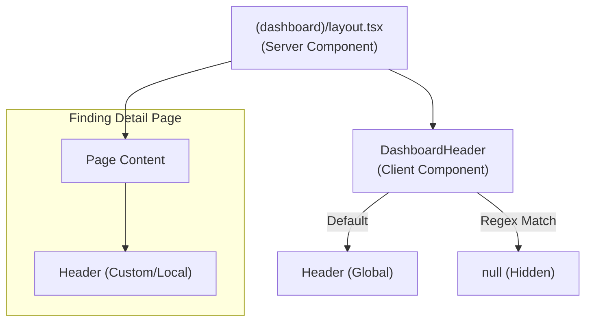

# Web Console Architecture

How the web console (`web/`) is built and how it talks to the API. Paths are
relative to `web/`. Related: [security architecture](security-architecture.md),
[calling the API](guides/API_INTEGRATION.md), [UI style contract](ui-style-contract.md).

## Overview

```
Browser
  React (Client Components), Zustand auth store, SWR cache
        |  same-origin requests: /api/v1/*, WebSocket /api/v1/ws
        v
Next.js server (Node.js)
  src/proxy.ts            signed-out redirect, locale, per-request CSP nonce
  Server Components and Server Actions
  src/app/api/v1/[...path]/route.ts   API proxy: session cookie -> Bearer token
        |  BACKEND_API_URL (server-side only)
        v
OpenCTEM API (Go, api/)
  business logic, authorization, PostgreSQL, Redis
```

The console holds no data of its own: every read and write goes to the API, and
the API is the only authority for authorization and tenant isolation. The console
hides what a user cannot use, nothing more.

Responsibilities of the console: the user interface, the sign-in flows and
session cookies, route protection (`RouteGuard`: module + permission), form
validation (Zod, re-checked by the API), and API error display.

## API access

```
src/lib/api/
├── client.ts          # get/post/put/patch/del, CSRF header, refresh and step-up retry
├── endpoints.ts       # URL builders (API_BASE, <area>Endpoints)
├── error-handler.ts   # ApiClientError, handleApiError
├── <area>-hooks.ts    # SWR hooks per area
├── <area>-types.ts    # area types
└── generated/         # contract types from the OpenAPI spec (not committed)
```

Details and examples: [guides/API_INTEGRATION.md](guides/API_INTEGRATION.md).

## Authentication flow

Sign-in is **local accounts (email/password)**, **OAuth social login** (Google,
GitHub, Microsoft) and **organization SSO** (OIDC such as Microsoft Entra ID, and
SAML), all implemented by the API; the console has no identity-provider SDK of
its own. Social and SSO callbacks land on `/auth/callback/[provider]` and
`/auth/sso/callback/[provider]`.

Tokens live in **httpOnly cookies** set by the Next.js BFF proxy — the browser
never sees a Bearer token. The browser calls the relative proxy path `/api/v1/*`
with `credentials: 'include'`; the proxy attaches the cookie-borne auth when it
forwards to `BACKEND_API_URL`. A double-submit `csrf_token` cookie (JS-readable)
is set on every page, before sign-in too, and echoed as the `X-CSRF-Token`
header on every state-changing request. The web server refuses (403) any
POST/PUT/PATCH/DELETE, signed in or not, that is not same-origin
(`Sec-Fetch-Site`, `Origin`, else `Referer`) or lacks the matching pair:
the Server Actions behind the sign-in, registration, password-reset,
invitation and second-factor forms (`src/proxy.ts`) and every route handler
under `src/app/api` (see `src/lib/server-auth-cookies.ts`).

```
1. User signs in (email/password, OAuth social, or SAML SSO)
   └─> Local: POST /api/v1/auth/login
   └─> Social/SSO: redirect to provider, return to
       /auth/callback/[provider] or /auth/sso/callback/[provider]

2. Server (proxy / route handler) exchanges credentials for tokens
   └─> Sets access + refresh tokens as httpOnly cookies
   └─> The csrf_token cookie (double-submit) was already set with the
       sign-in page; the sign-in request echoed it in X-CSRF-Token

3. Browser makes API calls to the relative proxy path
   └─> fetch('/api/v1/...', { credentials: 'include' })
   └─> Mutations also send X-CSRF-Token: <csrf_token cookie>

4. Proxy forwards to BACKEND_API_URL with the cookie-borne auth

5. Backend validates the JWT (signature + expiry) and returns data

6. On token expiry
   └─> Proxy/route handler refreshes via the refresh-token cookie
   └─> Rotates the httpOnly cookies; browser retries transparently
```

---

## Data patterns

- **Client Components + SWR** for most screens: a hook per resource with a
  string key, `null` when the user lacks permission (see the API guide).
- **Server Components** for reads that render on the server; they call the API
  with `BACKEND_API_URL` and the session cookie.
- **Server Actions** for form mutations that must run on the server (sign-in,
  sign-out); call `revalidatePath` afterwards.

## Design system

The shared UI primitives worth knowing (rules: [ui-style-contract.md](ui-style-contract.md)):

- **`DataTable`** (`src/features/shared/components/data-table/`) supports a server-pagination mode; list pages
  page/sort/filter against the backend instead of capping rows client-side.
- **`SeverityBadge`** (`src/features/shared/components/severity-badge.tsx`) is the single source of truth for severity colours
  (`src/lib/severity-colors.ts`); pages must not hardcode their own severity hues.
- **`Can`** (`src/lib/permissions/can.tsx`) gates UI by permission and supports a `minRole`
  prop; route-level access is enforced by `RouteGuard` (module + permission, see
  `src/config/route-permissions.ts`).
- **Routing:** the `/api/v1/*` BFF proxy is the route handler
  `src/app/api/v1/[...path]/route.ts`. Next.js 16's **`src/proxy.ts`** (it must sit
  next to `app/`; there is no `middleware.ts`) redirects signed-out page requests
  to `/login?next=` (the admin console to `/admin/login?next=`), picks the locale
  and sets the per-request CSP nonce ([security architecture](security-architecture.md) §3, §4.2). It checks cookie
  presence and shape only; the API validates the session, and the client clears
  a stale cookie on its first 401. `RouteGuard` then checks module and permission.

---

## Dashboard header

### **Header Centralization Strategy**

To optimize performance and maintainability, the Dashboard Header architecture follows a **Hybrid Server/Client Split**:



#### **1. Layout Layer (Server Component)**

- File: `src/app/(dashboard)/layout.tsx`
- **Role**: Acts as the skeleton shell. Handles SEO metadata, cookies (Sidebar state), and wraps content in Providers.
- **Why**: Must remain a Server Component to access `cookies()` and avoid de-optimizing the entire tree.

#### **2. Header Layer (Client Component)**

- File: `src/components/layout/dashboard-header.tsx`
- **Role**: Determines _visibility_ logic based on the current route.
- **Logic**:
  - **Default**: Renders the global `<Header />`.
  - **Exceptions**: Hides global header if route matches specific patterns (e.g. specialized detail pages).
  - **Implementation**: Uses `usePathname()` hook and Regex testing.
    ```typescript
    // Example: Hide global header only on Finding Detail pages
    const shouldHideHeader = /^\/findings\/[^/]+$/.test(pathname)
    ```

#### **3. Page Layer (Server/Client Hybrid)**

- **Standard Pages**: Do _not_ render their own header. They rely on the Global Header from the Layout.
- **Exception Pages** (e.g., `findings/[id]`):
  - The Global Header is hidden via the Regex logic above.
  - The Page renders its _own_ custom `<Header>` with specific context (e.g., Back button, Breadcrumbs, Status actions).

### **Advantages**

1.  **No duplicates**: pages do not render their own `<Header fixed />`.
2.  **Performance**: `layout.tsx` stays Server-Side. Only the Header island is Client-Side.
3.  **Flexibility**: Strict Regex allows precise exceptions (e.g., hiding header on `findings/123` but showing it on `findings/123/edit`).
